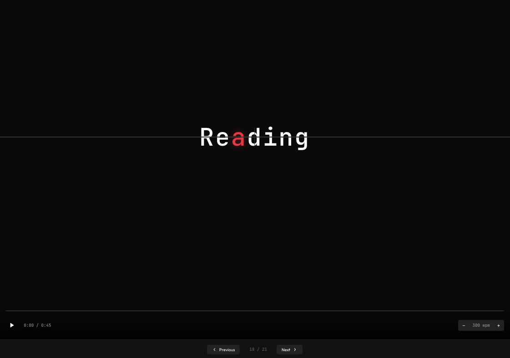

# SpeedRead

<p align="center">
  
</p>

<p align="center">
  <strong>A web-based EPUB reader with RSVP speed reading</strong>
</p>

---

## What is SpeedRead?

SpeedRead is a modern web application that lets you read EPUB books using **Rapid Serial Visual Presentation (RSVP)** — a speed reading technique that displays one word at a time at your chosen pace. This method eliminates eye movement and allows you to read much faster than traditional reading.

The app highlights the **Optimal Recognition Point (ORP)** of each word in red, helping your brain process words more efficiently.

<p align="center">
  
</p>

## Features

### 📚 Library Dashboard

- Upload EPUB files via drag & drop or file picker
- Grid view of your book collection with cover images
- Track reading progress across all books
- Books stored locally in your browser (IndexedDB)

### ⚡ Speed Reader (RSVP Mode)

- One word at a time display
- ORP (Optimal Recognition Point) highlighted in red
- Adjustable reading speed: 100 - 1200 WPM
- Video-like progress bar with time display
- Play/pause controls

### 📖 Text View

- Traditional reading mode
- Current position highlighted
- Click any word to jump to that position

### 🔀 Split View

- Speed reader and text view side by side
- Perfect for switching between speed reading and manual reading

### 📑 Chapter Navigation

- Sidebar with all chapters
- Word count per chapter
- Quick navigation between sections

### ⌨️ Keyboard Shortcuts

| Key     | Action                |
| ------- | --------------------- |
| `Space` | Play / Pause          |
| `←`     | Jump back 10 words    |
| `→`     | Jump forward 10 words |
| `↑`     | Increase WPM by 50    |
| `↓`     | Decrease WPM by 50    |

## Getting Started

### Prerequisites

- Node.js 18+
- npm or yarn

### Installation

```bash
# Clone the repository
git clone https://github.com/yourusername/epub-speed-reader.git
cd epub-speed-reader

# Install dependencies
npm install

# Start development server
npm run dev
```

Open [http://localhost:5173](http://localhost:5173) in your browser.

### Build for Production

```bash
npm run build
```

The built files will be in the `dist` folder.

## Tech Stack

- **React 19** - UI framework
- **TypeScript** - Type safety
- **Vite** - Build tool
- **epub.js** - EPUB parsing
- **localforage** - IndexedDB storage
- **React Router** - Navigation

## How RSVP Works

Traditional reading requires your eyes to move across lines of text, which takes time and energy. RSVP eliminates this by presenting words one at a time in a fixed position.

The **Optimal Recognition Point (ORP)** is the character in each word where your eye naturally focuses. By highlighting this point (shown in red), SpeedRead helps your brain recognize words faster.

With practice, most people can comfortably read at 400-600 WPM using RSVP, compared to the average 200-250 WPM of traditional reading.

## License

MIT
